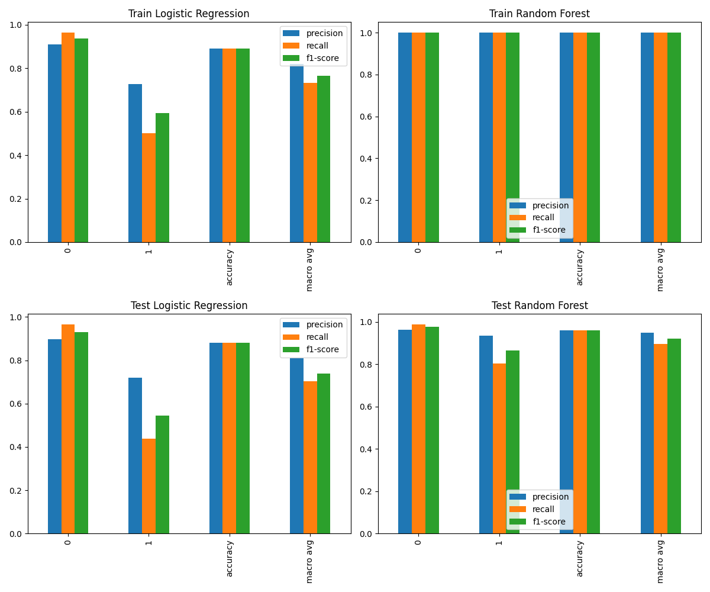
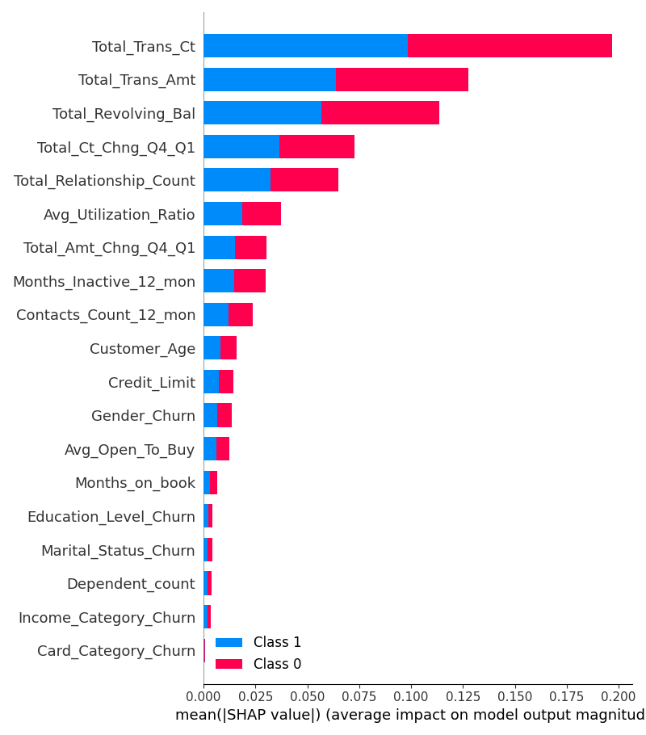

# Predict Customer Churn

- Project **Predict Customer Churn** of ML DevOps Engineer Nanodegree Udacity
---

## Project Description
This is the first project of Machine Learning DevOps Engineer Nanodegree. 
The goal of the project was to create a production-ready code based on
the given notebook code (`churn_notebook.ipynb`). Originally the project
was created to work with python 3.6 / 3.8, but I changed it to 3.11 and the
newest version of the libraries. It enforced slight chances in the code, 
namely:
- df.corr() -> df.corr(numeric_only = True)
- sklearn.metrics.plot_roc_curve -> sklearn.metrics.RocCurveDisplay


## Files and data description
The project is organized as follows:
- `data/` - folder with data
    - `bank_data.csv` - file with data used for model creation
- `images/` - folder with images
    - `eda/` - folder with Explanatory Data Analysis plots
    - `results/` - folder with training result plots
- `logs/` - folder with logs
    - `churn.log` - logs from `churn_library`.py script
- `test_output/` - folder used for tests (I did not want to overwrite the
actual results)
- `churn_library.py` - main file with code
- `test_churn_script_logging_and_tests.py` - unit tests
- `requirements_py3.11.txt` - requirements for python 3.11
- `pytest.ini` - pytest configuration (here logging only)

## Installation
```bash
conda create --name churn python==3.11.4 ipykernel
conda activate churn
pip install -r requirements_py3.11.txt
```

## Running files
To run the main script use
```bash
python churn_library.py
```
This file can be run with parameters. If you want to change the default 
parameters see:
```bash
python churn_library.py --help
```
To test the functions use:
```bash
pytest
```
By default pytest captures the logging. If you want to force logging level and
folder, you should use:
```bash
pytest -s --log-level=INFO --log-file=./logs/tests.log
```

## Results
#### ROC curve

As expected Random Forest looks better than Logistic Regression 
#### Classification report

Again, Random Forest shines
#### Feature importance
